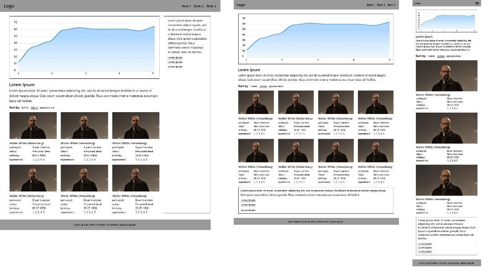

# Test App

Создать front-end приложение вывода списка персонажей сериала в соответствии с макетом.

 
Макет схематичный не нужно делать pixel perfect.

Данные для вывода нужно получить с [`API`](https://www.breakingbadapi.com/api/characters).

---

### Задание

- Вывод нужно организовать порциями, при прокрутке добавлять нужное количество и при выводе не должен замораживаться интерфейс. _(lazy loading)_

- Список персонажей должен сортироваться по статусу, имени и количеству сезонов, в которых был задействован персонаж. _(sort)_

- Сортировку нужно запоминать и при перезагрузке страницы она должна сохраняться. _(save sorted id's in storage)_

- График количества персонажей задействованных в сезоне нужно реализовать на `canvas` или `svg`.

---

### Требования к работе

- Сборка проекта на webpack.

- Семантичная кроссбраузерная адаптивная верстка (мин. IE 9), без использования flexbox.

- Использование Pre/Post процессоров (SCSS/SASS, Stylus, LESS, PostCSS). Использование соглашений/архитектур написания стилей Bem.
- Работа должна быть реализована на нативном javascript (es5/es6).
